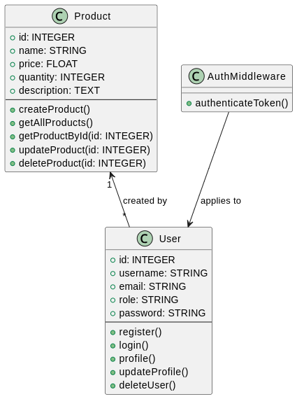
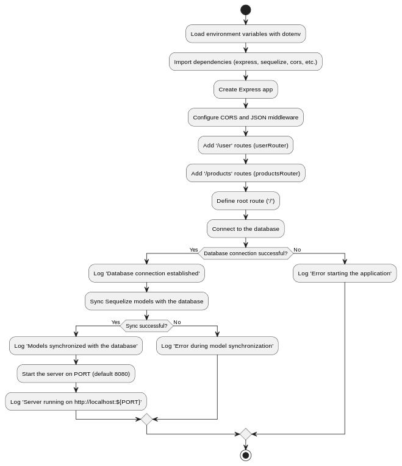

# Point Of Sell API

### Table of Contents

1. [Project Description](#project-description)
2. [Key Features](#key-features)
   - [Authentication System](#authentication-system)
   - [Product Management](#product-management)
3. [Technologies Used](#technologies-used)
4. [Architecture](#architecture)
5. [Diagrams](#diagrams)
   - [Class Diagram](#class-diagram)
   - [Index Flowchart](#index-flowchart)
6. [Example Database](#example-database)
   - [Product Table](#product-table)
   - [User Table](#user-table)
7. [Api Endpoints](#api-endpoints)
8. [References](#references)

---
### Project Description: **Inventory and Authentication System**

This project is a web-based application that serves as an inventory and user management system. It includes features for managing products in an inventory (create, view, update, delete) and user authentication (registration, login, profile management). The system allows different user roles to interact with the application, including general users and administrators.

#### Key Features:
1. **Authentication System**:
   - **User Registration**: Allows new users to sign up with a unique username and password.
   - **Login**: Users can log in using their credentials.
   - **Profile Management**: Users can view, update, and delete their profiles.
   - **Authentication Middleware**: Ensures that users are authenticated before accessing specific routes.

2. **Product Management** (Admin Only):
   - **Create Product**: Administrators can add new products to the inventory.
   - **View Products**: Users and admins can view the list of all products in the inventory.
   - **View Product by ID**: Users can search for and view details of a specific product.
   - **Update Product**: Admins can modify details of existing products.
   - **Delete Product**: Admins can remove products from the inventory.
#### Technologies Used:
- **Backend**: [Node.js](https://nodejs.org/en) with [Express](http://expressjs.com/) for the server-side logic.
- **Database**: [Sequelize](https://sequelize.org/) ORM to interact with a relational database [PostgreSQL](https://www.docker.com/blog/how-to-use-the-postgres-docker-official-image/).
- **Containerization**: [Docker](https://www.docker.com/) for containerizing the database, ensuring consistency across different environments and simplifying deployment.
- **Authentication**: JSON Web Tokens ([JWT](https://jwt.io/)) for secure user authentication.
- **Middleware**: Middleware for protecting routes that require authentication.
- **Environment Variables**: [dotenv](https://www.npmjs.com/package/dotenv) for managing sensitive configurations like database credentials and JWT secrets.
#### Architecture:
- The application follows a **RESTful API** architecture, with endpoints for authentication and product management.
- The **MVC (Model-View-Controller)** pattern is used to structure the application, ensuring clear separation between data, logic, and presentation.
- The application is designed with scalability in mind, enabling easy addition of new features and endpoints in the future.

---

### Diagrams
#### Class Diagram  

#### Index Flowchart 

### Example Database
#### Product Table

| id  | name        | price | quantity | description        | createdAt           | updatedAt           |
|-----|-------------|-------|----------|--------------------|---------------------|---------------------|
| 1   | Apple       | 1.20  | 100      | Fresh red apple    | 2025-01-01 10:00:00 | 2025-01-01 10:00:00 |
| 2   | Banana      | 0.50  | 150      | Yellow ripe banana | 2025-01-02 11:00:00 | 2025-01-02 11:00:00 |
| 3   | Carrot      | 0.30  | 200      | Fresh orange carrot| 2025-01-03 12:00:00 | 2025-01-03 12:00:00 |
#### User Table

| id  | username    | email                | role      | password         | createdAt           | updatedAt           |
|-----|-------------|----------------------|-----------|------------------|---------------------|---------------------|
| 1   | jdoe        | jdoe@example.com      | admin     | hashed_password  | 2025-01-01 09:00:00 | 2025-01-01 09:00:00 |
| 2   | janedoe     | janedoe@example.com   | user      | hashed_password  | 2025-01-02 10:00:00 | 2025-01-02 10:00:00 |
| 3   | sarahsmith  | sarah@example.com     | user      | hashed_password  | 2025-01-03 11:00:00 | 2025-01-03 11:00:00 |

---

### Api Endpoints
#### Products
| **Method**  | **Route**         | **Description**                | **Function**          | **Authentication** |
|-------------|-------------------|--------------------------------|-----------------------|-------------------|
| GET         | `/` | Test api running |  | No |
| POST        | `/products/`               | Create a new product           | createProduct         | Yes               |
| GET         | `/products/`               | Get all products               | getAllProducts        | No                |
| GET         | `/products/:id`            | Get a product by ID            | getProductById        | No                |
| PUT         | `/products/:id`            | Update a product by ID         | updateProduct         | Yes               |
| DELETE      | `/products/:id`            | Delete a product by ID         | deleteProduct         | Yes               |
| POST        | `/user/register`       | Register a new user            | register              | Yes               |
| POST        | `/user/login`          | Log in                         | login                 | No                |
| GET         | `/user/profile`        | Get the user's profile         | profile               | Yes               |
| PUT         | `/user/profile`        | Update the user's profile      | updateProfile         | Yes               |
| DELETE      | `/user/profile`        | Delete the user's profile      | deleteUser            | Yes               |
---

### References

1. **Node.js**. (n.d.). *Node.js | JavaScript runtime built on Chrome's V8 JavaScript engine*. Retrieved from [https://nodejs.org/en](https://nodejs.org/en)
2. **Express**. (n.d.). *Express - Node.js web application framework*. Retrieved from [http://expressjs.com/](http://expressjs.com/)
3. **Sequelize**. (n.d.). *Getting Started Sequelize*. Retrieved from [https://sequelize.org/docs/v6/getting-started/](https://sequelize.org/docs/v6/getting-started/)
4. **PostgreSQL**. (n.d.). *How to Use the Postgres Docker Official Image*. Retrieved from [https://www.docker.com/blog/how-to-use-the-postgres-docker-official-image/](https://www.docker.com/blog/how-to-use-the-postgres-docker-official-image/)
5. **Docker**. (n.d.). *Docker Documentation*. Retrieved from [https://www.docker.com/](https://www.docker.com/)
6. **JWT**. (n.d.). *JSON Web Tokens (JWT)*. Retrieved from [https://jwt.io/](https://jwt.io/)
7. **dotenv**. (n.d.). *dotenv - Zero dependency module that loads environment variables from a .env file*. Retrieved from [https://www.npmjs.com/package/dotenv](https://www.npmjs.com/package/dotenv)
